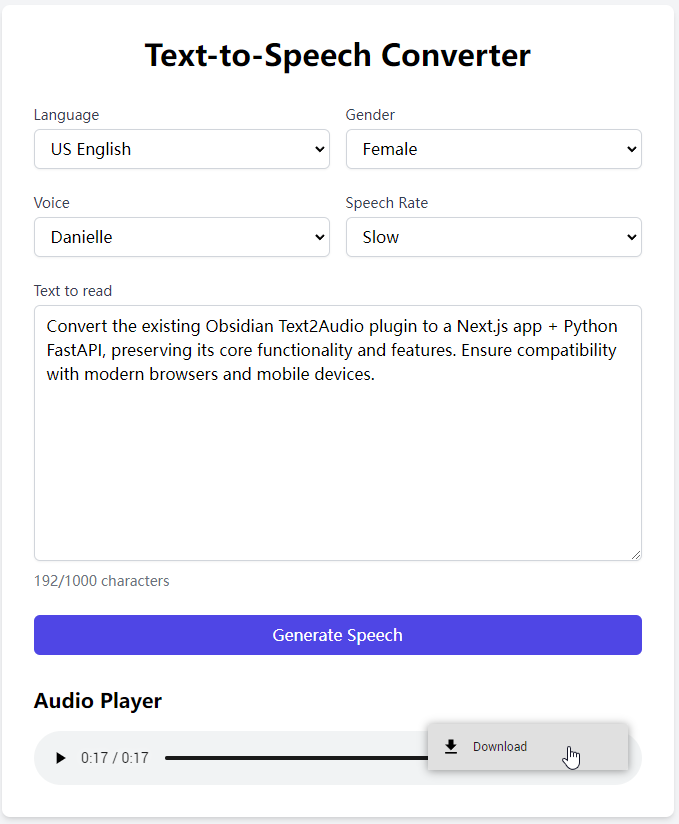

# AmazonVoiceWizard

Transform text into lifelike speech with AmazonVoiceWizard! This demo showcases Amazon Polly's text-to-speech capabilities using Python and Vue.js. Customize voices, languages, and speech rates for an interactive audio experience.

## Setup

### Environment Variables

To use this project, you need to set up your AWS credentials. Follow these steps:

1. Copy the `.env.example` file to a new file named `.env`:

   ```
   cp .env.example .env
   ```

2. Open the `.env` file and edit your AWS credentials:

   ```
   AWS_ACCESS_KEY_ID=your_access_key_here
   AWS_SECRET_ACCESS_KEY=your_secret_key_here
   ```

   Replace `your_access_key_here` and `your_secret_key_here` with your actual AWS credentials.

3. Make sure to keep your `.env` file secure and never commit it to version control.

For more information on obtaining AWS credentials, visit the [AWS documentation](https://docs.aws.amazon.com/general/latest/gr/aws-sec-cred-types.html#access-keys-and-secret-access-keys).

## Running the Application

1. Install the required Python packages:

   ```
   pip install -r requirements.txt
   ```

2. Run the application:

   ```
   python server.py
   ```

   The application will start running on `http://localhost:8000`.

## Using the Application

1. Ensure the backend server is running:

   ```
   python server.py
   ```

2. Open your web browser and go to `http://localhost:8000/index.html`.

3. You'll see a user interface similar to the image, with options to:

   - Select the language
   - Choose the gender of the voice
   - Pick a specific voice
   - Set the speech rate
   - Enter the text you want to convert to speech

   

4. After entering your desired text and selecting your preferences, click the "Generate Speech" button.

5. Once the audio is generated, you can play it using the audio player at the bottom of the page or download it for later use.
